# 📚 AI Research Paper Intelligence System

## 📖 Overview

The **AI Research Paper Intelligence System** is an end-to-end Deep Learning and Natural Language Processing (NLP) project designed to simplify the process of understanding research papers.

Instead of manually reading lengthy research papers to find important technical information, this system automatically extracts, summarizes, analyzes, and organizes the content into structured knowledge.

The project helps researchers, students, and AI enthusiasts quickly identify key information such as datasets, models, hyperparameters, evaluation metrics, and related research papers.

---

## 🎯 Motivation

While working on an AI-based Satellite Image Change Detection project, I spent a significant amount of time reading research papers. I realized that instead of learning from the papers, I was constantly searching for specific information such as model architectures, datasets, hyperparameters, and evaluation metrics.

This project was developed to reduce that manual effort by creating an intelligent system capable of understanding research papers and presenting the most important information in an organized way.

---

## ✨ Features

* 📄 Download research papers directly from arXiv
* 📑 Extract text from PDF documents
* 🧹 Text preprocessing and cleaning
* 📚 Automatic section detection (Abstract, Introduction, Methodology, Results, Conclusion)
* 📝 Paper-level and section-wise summarization using FLAN-T5
* 🔍 Custom Technical Named Entity Recognition (NER)
* 📊 Hyperparameter extraction
* 📈 Evaluation metric extraction
* 🔑 Keyword extraction using KeyBERT
* 🏷️ Research domain classification
* 💡 Basic novelty analysis
* 🕸️ Knowledge graph generation
* ❓ Question Answering over research papers
* 🤝 Similar research paper recommendation using Sentence Transformers

---

## 🏗️ Workflow

```
Research Paper PDF
        │
        ▼
PDF Text Extraction
        │
        ▼
Text Cleaning & Preprocessing
        │
        ▼
Section Detection
        │
        ├── Technical NER
        ├── Hyperparameter Extraction
        ├── Evaluation Metric Extraction
        ├── Keyword Extraction
        ├── Domain Classification
        │
        ▼
Paper & Section-wise Summarization
        │
        ▼
Knowledge Graph Generation
        │
        ▼
Question Answering
        │
        ▼
Similar Paper Recommendation
```

---

## 🛠️ Technology Stack

| Technology                | Purpose                                 |
| ------------------------- | --------------------------------------- |
| Python                    | Core programming language               |
| PyTorch                   | Deep Learning framework                 |
| Hugging Face Transformers | Transformer models                      |
| FLAN-T5                   | Text summarization & Question Answering |
| Sentence Transformers     | Semantic similarity                     |
| spaCy                     | NLP preprocessing                       |
| KeyBERT                   | Keyword extraction                      |
| NetworkX                  | Knowledge graph generation              |
| Pandas                    | Data manipulation                       |

---

## 🔍 Custom Technical NER

One of the main highlights of this project is the **Custom Technical Named Entity Recognition (NER)** module.

Unlike traditional NER models that recognize entities such as **Person**, **Organization**, and **Location**, this project identifies AI-specific entities including:

* Machine Learning Models
* Frameworks
* Libraries
* Datasets
* Optimizers
* Evaluation Metrics
* Programming Languages
* Hardware

This makes the system more effective for analyzing technical research papers.

---

## ⚙️ Installation

### Clone the Repository

```bash
git clone https://github.com/yourusername/AI-Research-Paper-Intelligence-System.git
cd AI-Research-Paper-Intelligence-System
```

### Install Dependencies

```bash
pip install -r requirements.txt
```

### Launch Jupyter Notebook

```bash
jupyter notebook
```

Open the notebook and run the cells sequentially.

---

## 📂 Project Structure

```
AI-Research-Paper-Intelligence-System/
│
├── AI_Research_Paper_Intelligence_System.ipynb
├── README.md
├── assets/
└── models/
```

---

## 📸 Sample Outputs

The project generates:

* 📄 PDF Download & Text Processing

    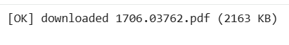

* 📚 Automatic Section Detection

    

* 🔍 Custom Technical Named Entity Recognition (NER)

    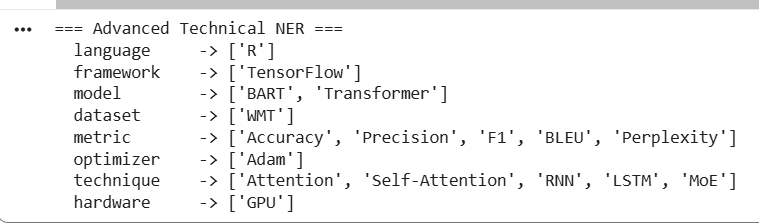

*  🔍 Traditional NER Comparison

    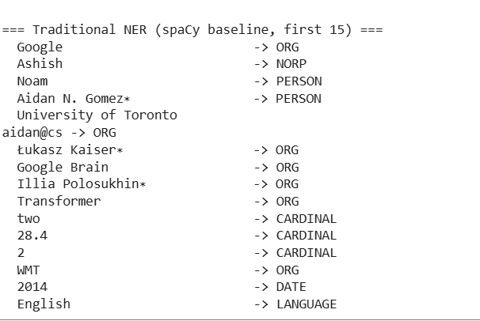

* 📊 Hyperparameter Extraction

    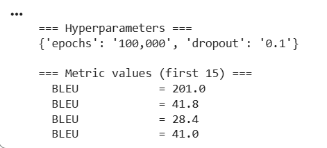

* 📝 Section-wise Summarization

    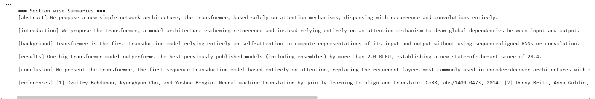

* 🔑 Keyword Extraction

    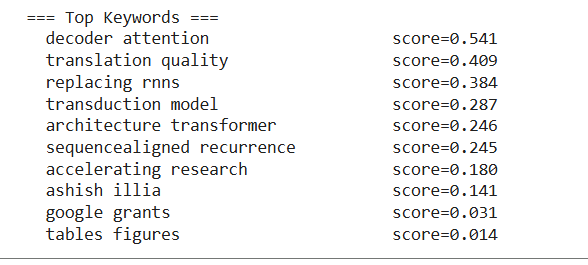

* 🏷️ Research Domain Classification

    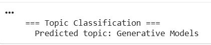

* 💡 Novelty Analysis

    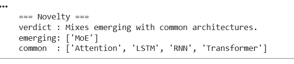

* 🕸️ Knowledge Graph Generation

    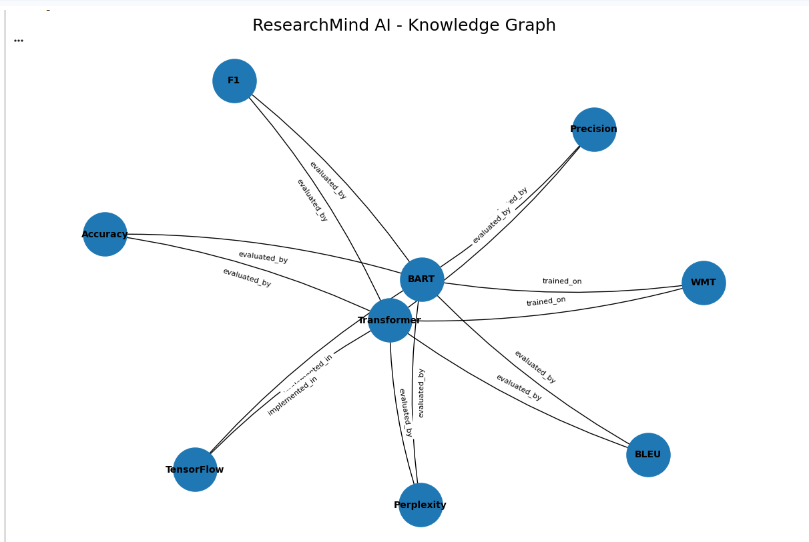

* ❓ Question Answering

    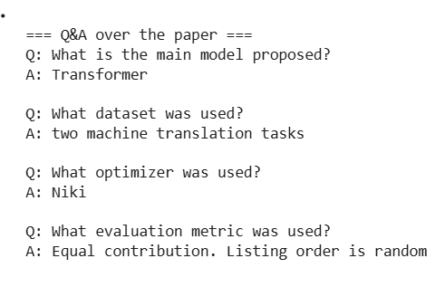

* 🤝 Similar Research Paper Recommendation

    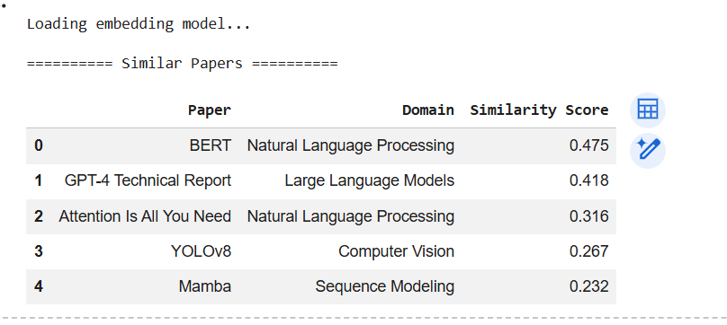


---

## 🚀 Future Improvements

* Retrieval-Augmented Generation (RAG)
* Interactive Web Interface
* Multi-paper comparison
* Citation recommendation
* Fine-tuned Technical NER model
* Vector database integration (FAISS/ChromaDB)
* Interactive knowledge graph visualization

---

## 📚 Learning Outcomes

Through this project, I gained hands-on experience in:

* Deep Learning
* Natural Language Processing
* Transformer Models
* Information Extraction
* Semantic Search
* Knowledge Graphs
* Question Answering Systems
* End-to-End AI Pipeline Design

---

## 🙏 Acknowledgements

This project was developed as part of my internship at **Coding Blocks School of Technology (CBSOT)**.

I would like to thank my mentor and the CBSOT team for their guidance and the opportunity to work on this project.

---

## 📜 License

This project is intended for educational and learning purposes.

---

## ⭐ Support

If you found this project useful, consider giving it a ⭐ on GitHub.

Feedback and suggestions are always welcome! 
